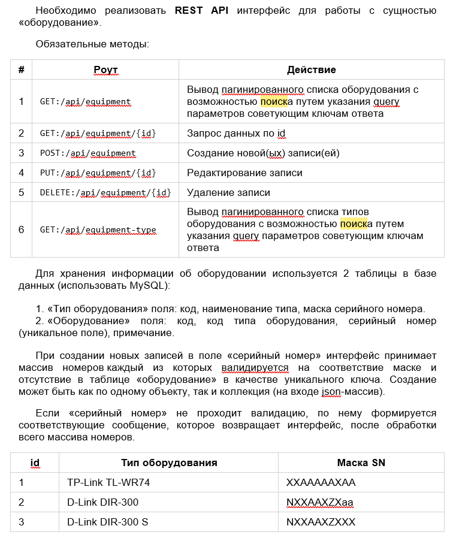
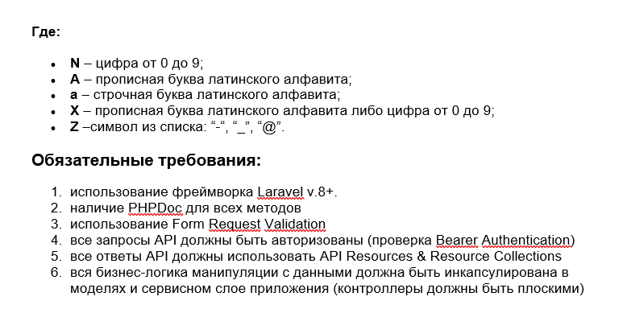

# eqi_front2





## Project Setup

```sh
composer install
php artisan migrage --seed
php artisan key:generate
check for user in database and login to front or login with api/login
get token and try api methods
```
